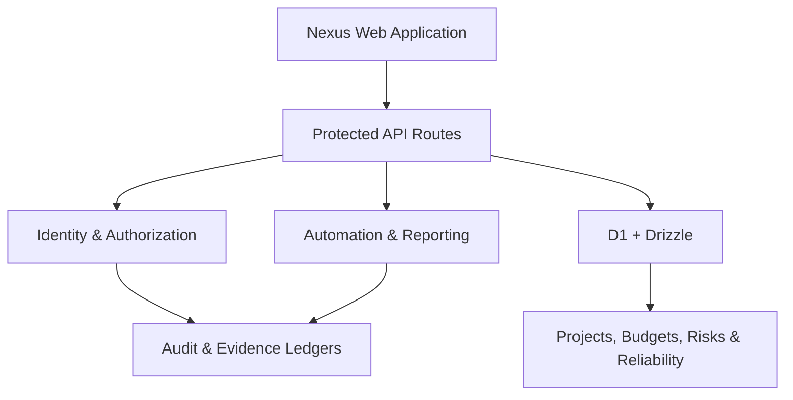

# Project Nexus

<p align="center">
  <strong>An enterprise-grade project, portfolio, security, and reliability command center.</strong>
</p>

<p align="center">
  Plan delivery, coordinate teams, govern access, automate operations, control financials, and respond to incidents from one responsive workspace.
</p>

<p align="center">
  <a href="https://project-nexus.imkshitijraj.chatgpt.site"><strong>Open the live application</strong></a>
  ·
  <a href="#core-capabilities">Capabilities</a>
  ·
  <a href="#local-development">Local setup</a>
  ·
  <a href="./CHANGELOG.md">Changelog</a>
</p>

---

## Overview

Project Nexus is a full-stack operations platform designed to move beyond static project dashboards. It combines portfolio management, multi-user collaboration, controlled financial changes, automation, enterprise administration, and incident response in a single governed system.

Every critical command is tied to authenticated identity, project-level authorization, rate protection, conflict handling, and traceable audit evidence.

## Core Capabilities

| Area | What Nexus provides |
| --- | --- |
| Executive Portfolio | Portfolio KPIs, project health, delivery progress, workload, exceptions, and global search |
| Project Operations | Persistent projects, assignable tasks, dependencies, comments, mentions, milestones, and activity history |
| Access Control | Workspace invitations, multi-level roles, project membership, session controls, and permission-gated commands |
| Security Center | Risk scoring, suspicious-access events, adaptive protection, emergency lockdown, and immutable audit records |
| Financial Control | Editable allocations, actual and committed spend, forecasts, revision reasons, conflict checks, and change logs |
| Risk & Governance | Probability-impact scoring, owners, mitigation actions, governed status updates, and risk heat maps |
| Automation | Deadline reminders, approval escalation, recurring tasks, risk alerts, status updates, and execution history |
| Reporting | Portfolio analytics, productivity signals, workload forecasts, budget variance, and PDF/Excel-compatible exports |
| Enterprise Admin | Workspace policies, custom roles, data retention, API credentials, webhook controls, and SSO readiness |
| Reliability | Service catalog, live health, SEV incident workflows, change approvals, rollback plans, runbooks, RTO, and RPO |

## Product Highlights

- Responsive desktop and mobile experience
- Light and dark appearance modes
- Global command palette with `Ctrl/Cmd + K`
- Authenticated, server-protected write operations
- Workspace and project-level role enforcement
- Durable Cloudflare D1 persistence with Drizzle migrations
- Concurrency protection for controlled edits
- Searchable operational and governance ledgers
- Request IDs and production error tracking
- Demonstration fallback data when live storage is unavailable

## Technology

- Next.js 16 and React 19
- TypeScript
- Vinext and Vite
- Cloudflare Workers
- Cloudflare D1
- Drizzle ORM
- Tailwind CSS
- Node.js 22+

## Architecture



The user interface calls project-scoped API routes. Each protected command resolves the authenticated user, checks workspace and project permissions, validates revisions, applies rate limits, writes durable records, and records an evidence event.

## Repository Structure

```text
app/
  api/                    Protected application endpoints
  budget-control.tsx      Financial workspace and revision history
  enterprise-modules.tsx Automation, reporting, integrations, and administration
  governance-control.tsx Risks, milestones, and delivery governance
  reliability-control.tsx Services, incidents, changes, and recovery
  page.tsx                Main responsive product shell
db/
  index.ts                D1 connection helpers
  schema.ts               Application data model
drizzle/                  Versioned database migrations
lib/
  automation-engine.ts    Automation evaluation and execution
scripts/                  Verified build and artifact tooling
tests/                    Production render validation
worker/
  index.ts                Cloudflare Worker entrypoint
```

## Local Development

### Prerequisites

- Node.js `>=22.13.0`
- npm
- Linux, WSL, or a compatible environment with `flock`, `curl`, and GNU `timeout`

### Install and run

```bash
npm run install:ci
npm run dev
```

Open the local URL printed by Vite.

### Quality checks

```bash
npm run lint
npm test
```

`npm test` builds the production application, validates the deployable Worker artifact, and verifies rendered metadata.

### Database migrations

After modifying `db/schema.ts`, generate a migration:

```bash
npm run db:generate
```

Review the generated SQL under `drizzle/` before deployment.

## Authentication and Access

The production application uses Sign in with ChatGPT identity headers supplied by the hosting environment. Authentication establishes identity; Nexus then applies its own workspace membership, role, project-access, and command-policy checks.

For production deployments:

- Keep write endpoints authenticated.
- Preserve server-side permission checks even when controls are hidden in the UI.
- Never commit OAuth credentials, API keys, webhook secrets, or environment files.
- Configure external OAuth integrations and SSO through secure deployment settings.

## Deployment

The live application is hosted through ChatGPT Sites:

**[project-nexus.imkshitijraj.chatgpt.site](https://project-nexus.imkshitijraj.chatgpt.site)**

The repository contains the source and database migrations required by the current production release. Hosting bindings are declared in `.openai/hosting.json`.

## Roadmap

- Real-time presence and collaborative editing
- Configurable workflow designer
- Expanded integration adapters
- Organization-level multi-workspace controls
- Mobile push notifications
- Observability dashboards and SLO burn-rate alerts
- Automated backup and restore operations

## Changelog

See [CHANGELOG.md](./CHANGELOG.md) for the complete release history, from the initial interactive MVP through the Incident & Reliability Command Center.

## Author

Built and maintained by [Kshitij Raj](https://github.com/imkshitijraj).

---

<p align="center">
  <strong>Project Nexus</strong><br />
  One command center for delivery, governance, security, and reliability.
</p>
